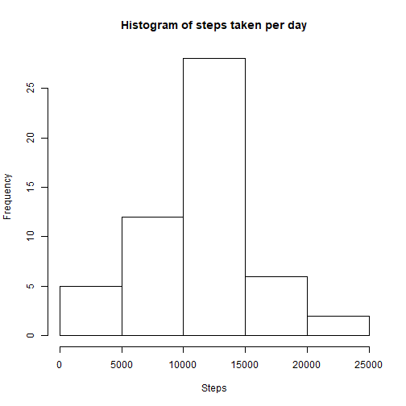
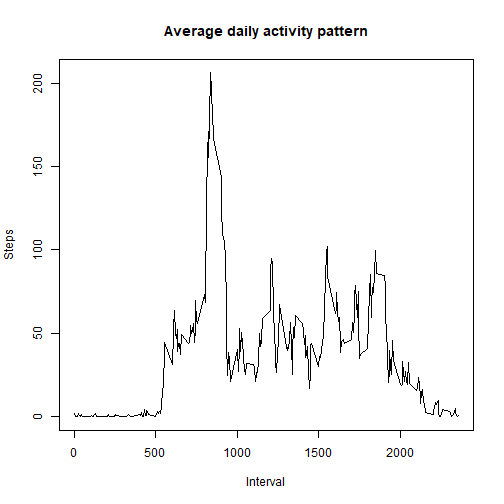
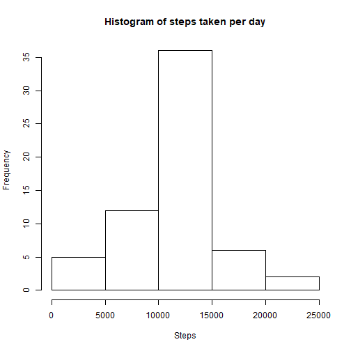
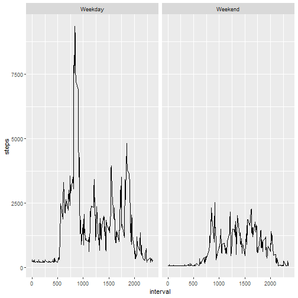

Assignment 1
============

```r
activity <- read.csv(file="C:\\Users\\silvi\\OneDrive\\Desktop\\Coursera\\5.Reproducible research\\Assignment 1\\activity.csv")
```
##What is the mean number of steps taken per day?

```r
#calculate the total number of steps taken per day
library(plyr)
totalStep <- aggregate(steps~ date, data=activity, sum)
#Make a histogram of a total number of steps per day
hist(totalStep$steps,main="Histogram of steps taken per day", xlab="Steps")
```



```r
#Calcualte and report the mean and median of the total number of steps per day
meanSteps <-as.integer(mean(totalStep$steps))
medianSteps <- median(totalStep$steps)
```

###The mean of the total number of steps per day is  10766, while the median is 10765.

#What is the average daily activity pattern?

```r
averageSteps <- aggregate(steps~interval , data=activity,mean)
plot(averageSteps$interval,averageSteps$steps, type="l", main="Average daily activity pattern", ylab="Steps", xlab="Interval")
```



```r
maxstep <- which.max(averageSteps$interval)
interval <- averageSteps$interval[[maxstep]]
stepNumber <- averageSteps$steps[[maxstep]]
```
###The interval which had the most steps(1.0754717) is interval 2355. When we compare this to the previous values, we can see they decreased.

#Imputing missing values
###To impute the missing values we decided to use the mean.

```r
full.data <- transform(activity, steps = ifelse(is.na(activity$steps), mean(steps,na.rm=TRUE),steps))
full <- transform(full.data, interval <- ifelse(is.na(interval), mean(interval,na.rm=TRUE),interval))


totalStep2 <- aggregate(steps~ date, data=full, sum)
#Make a histogram of a total number of steps per day
hist(totalStep2$steps,main="Histogram of steps taken per day", xlab="Steps")
```



```r
#Calcualte and report the mean and median of the total number of steps per day
meanStepsImp <-as.integer(mean(totalStep2$steps))
medianStepsImp <-as.integer(median(totalStep2$steps))
```
###The mean of the total number of steps per day is  10766, while the median is 10766. 


#Are there differences in activity patterns between weekdays and weekends? 
###From the graphs below we can see that the average activity is lower during the weekend, as opposed during weekdays.

```r
full$date <- as.Date(as.character(full$date))
full$day <- weekdays.Date(full$date)
full$week <- ifelse(full$day %in% c("Saturday","Sunday"), "Weekend", "Weekday")
totalStep3 <- aggregate(steps~ interval + week, data=full, sum)
totalStep3$week <- as.factor(totalStep3$week)
library(ggplot2)
g <- ggplot(totalStep3, aes(interval,steps))
g + geom_line() + facet_wrap(~week)
```


